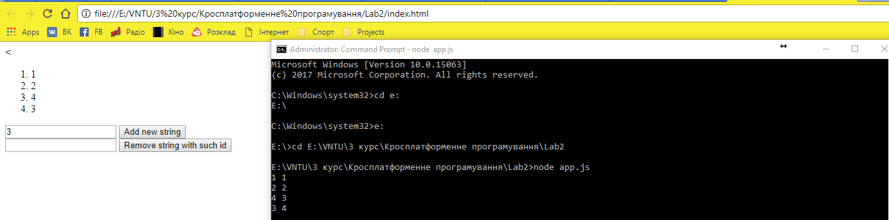

# Лабораторна робота №2. Серверний додаток з API

## Опис програми

  Даний додаток здатен відправляти наступні запити на сервер(додавання запису, видалення запису із заданим id, отримання всіх записів). Також присутня валідація введеного id.

  Було додано деяку кількість записів.
 

  Було видалено запис з id=3.
 

  Було видалено ще кілька записів з id=1.
 

  В поле id було введено некоректні дані.
 

## Висновок

В даній роботі було набуто базових навичок створення серверного додатку та роботи з його API.

